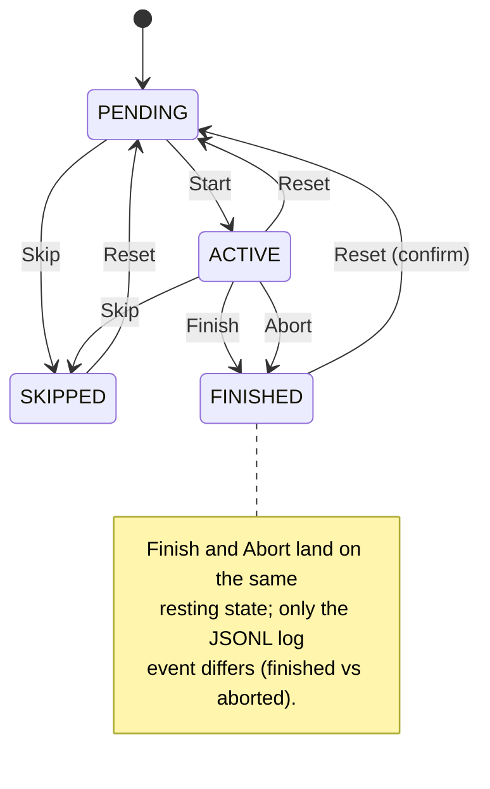
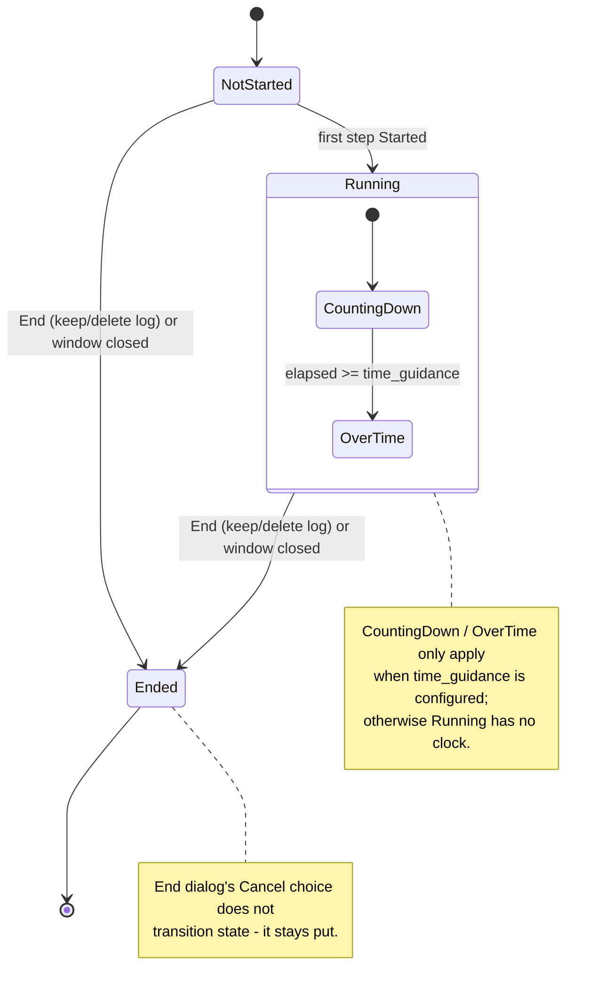

# AGENTS.md

## Project

- Python 3.14 
- Tkinter
- Avoid external libraries.
- TOML for the runsheet format.
- JSONL for the log format.

## UI Semantics

These are behavioral contracts, established deliberately — preserve them
when touching `app.py` / `step_panel.py` / `announcements.py` unless the
user explicitly asks to change one.

### Step state machine

- States: `PENDING`, `ACTIVE`, `FINISHED`, `SKIPPED`. `RESTARTED` and
  `ABORTED` are transient *action* identifiers only (toolbar target
  state, log event name) — neither is ever a resting `step.state`:
  Reset always resolves directly to `PENDING`, and Abort always
  resolves directly to `FINISHED`.
- Allowed transitions (`_ALLOWED_FROM` in `app.py`): Start `PENDING` ->
  `ACTIVE`; Finish `ACTIVE` -> `FINISHED`; Abort `ACTIVE` -> `FINISHED`;
  Reset `ACTIVE`/`FINISHED`/`SKIPPED` -> `PENDING`; Skip
  `PENDING`/`ACTIVE` -> `SKIPPED`.
- Abort is Finish with a different log event: same resting state
  (`FINISHED`), same auto-collapse/auto-advance behavior, same badge
  (tick) — only the JSONL event name (`aborted` vs `finished`) records
  that the step didn't succeed. There is deliberately no separate
  "aborted" resting state or badge; don't add one without the user
  asking.

- **More than one step can be `ACTIVE` at once.** Steps can be started
  out of order; nothing enforces linear sequencing. Selection-advance
  and any "what's next" logic must account for this — never assume the
  active/pending step is always the one after the current index.
- Resetting a `FINISHED` step requires an explicit confirm dialog
  (undoing completed work is consequential); Reset from `ACTIVE` or
  `SKIPPED` does not.

### Selection and focus

- Selecting a `PENDING` step auto-expands its panel (it's "eligible to
  run"). Finishing or Skipping the current step auto-collapses it.
- After Finish or Skip, selection auto-advances to the **earliest**
  step in the *entire* runsheet that is neither `FINISHED` nor
  `SKIPPED` (i.e. `PENDING` or `ACTIVE`) — scan from index 0, not just
  forward from the current step. An out-of-order step left `ACTIVE`
  earlier in the list must pull focus back to it.
- Whenever selection lands somewhere (via Start, or via auto-advance),
  the view scrolls so the *preceding* step sits at the top and the
  newly-selected step is second, if possible (`_scroll_into_view`,
  clamped naturally at the ends of the list). Any future "jump to a
  step" feature should reuse this, not invent new scroll positioning.
- Toolbar action enable/disable state is driven purely by the
  *currently selected* step's state, never the runsheet as a whole.
  Disabled actions grey out but stay in place — the toolbar's shape
  and four colors never change.

### Toolbar layout

- Two labeled groups, left-to-right: RUNSHEET (the time-guidance clock
  if configured, then END) then STEP (Start/Finish/Abort/Reset/Skip).
- END is always enabled, independent of runsheet completion — ending
  is a valid action at any point, not just when finished. Clicking it
  always opens a 3-choice modal: Cancel / Exit, Keep Log / Exit,
  Delete Log. It never just "locks the toolbar and stays open" — the
  only outcomes are cancel or a real process exit.

### Runsheet session lifecycle

- Not a `step.state` machine — there's no `RunsheetState` enum in code —
  but the session has an implicit lifecycle worth keeping straight:
  `NotStarted` (before any step's first Start; `run_started_at is
  None`) -> `Running` (from the first Start of the session, whichever
  step that is) -> `Ended` (a `session_end` log event, then the window
  is destroyed — via End / Keep Log, End / Delete Log, or the window's
  close button; End's Cancel choice does not transition anything).
- While `Running`, if `time_guidance` is configured the RUNSHEET clock
  has its own two-phase sub-state — `CountingDown` then `OverTime` —
  described fully under Clocks below.

### Clocks

- Per-step time-budget clock (`step_panel.py`): a circular pie wedge,
  always sweeping *clockwise*. Two laps: green **drains** (unfills)
  from full to empty over 0-100% of budget; amber then **fills** (the
  inverse) from empty to full over 100-200%, a grace period; past 200%
  it's solid red and static. The two laps use different anchor-angle
  formulas (trailing edge fixed at 12 for the drain, leading edge
  fixed at 12 for the fill) specifically so both sweep clockwise —
  don't reuse one formula for both or the fill lap runs backwards.
- Runsheet-level clock (`time_guidance`, optional): **one** clock, not
  two. Counts down from `time_guidance` starting when the *first* step
  of the session is started (whichever step that is, not necessarily
  step 1); once it reaches zero it flips to counting up from zero,
  prefixed `+`, in bold. It is a continuous session clock — resetting
  the first step does not reset it.

### Step badge (left of the title)

- `PENDING`: unfilled triangle (▷, play-button style). `ACTIVE`: filled
  triangle (▶). Both always black border/fill, regardless of the
  badge's tinted background box (which still uses the state's accent
  color). `FINISHED`: tick. `SKIPPED`: dash.

### Announcements

- Per-step ANNOUNCEMENTS box (STARTED/FINISHED rows + Copy chips): only
  rendered when the step has any; sits at the *bottom* of the step
  body, after Commands.
- Runsheet-level announcements render as two "pseudo step" panels
  bookending the real step list (RUNSHEET STARTED before the first
  step, RUNSHEET FINISHED after the last) — not a separate banner.
  These are plain `tk.Frame` widgets, never added to `self.panels` or
  `runsheet.steps`, so they must stay invisible to selection, the
  state machine, scrolling math, and the progress count.

### Footer

- Runsheet filename, sha1, and log filename are each individually
  click-to-copy (copies the *full* path/hash, not just what's shown)
  with a "copied" flash. The log field shows only the filename, never
  the full path.

### Input

- Scrolling must work via mouse wheel, scrollbar drag, *and* keyboard
  (Up/Down/PageUp/PageDown/Home/End) — the keyboard path exists
  specifically because wheel events don't reliably reach Tk in some
  remote/screen-sharing environments.
