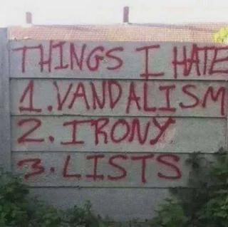

# Rationale

Credit: from [gagbase.com](https://gagbase.com/memes/things-i-hate-ironic-vandalism-meme/) but
I first saw this pictures years ago somewhere on the Internet.

This is a lab experiment let loose. I needed a goal for a vibe coding exercise this subject 
provided the opportunity to also try [Claude Design](https://claude.com/product/design).

I'm no fan of ClickOps but understand its practicality, or more accurately the impracticality
of automating some procedures. This tool is meant as a proof of concept to simplify the
book-keeping that may be required.

The goal with the UI behavior and runsheet execution was to be intuitive but not overly
rigid. Too often these procedures have strange unexpected variations. I also played around 
with how to visually expended time in each step, that I am not convinced is intuitive but
is at least interesting (to me).
