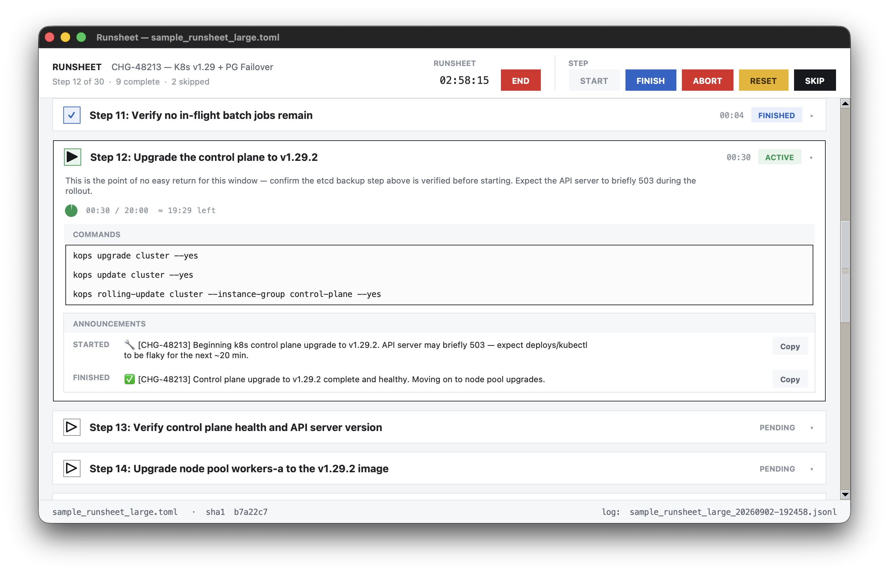
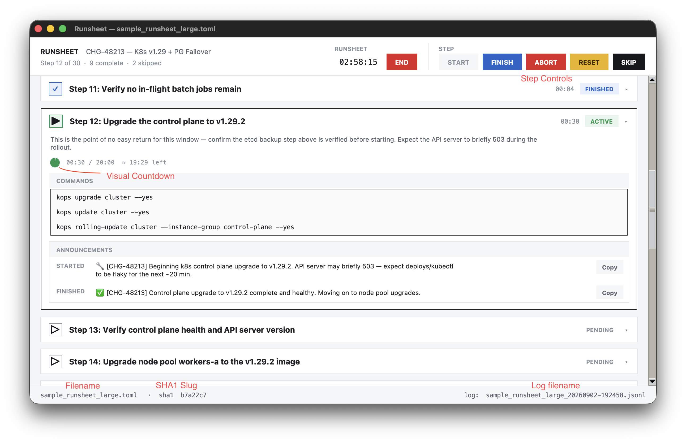

# Runsheet

A simple portable ClickOps UI for following a runsheet. See the [rationale](RATIONALE.md) for more details..



## Features

- Sequencing with automatic advance.
- Parallel execution.
- Optional timers.
- Session log in JSONL.
- MIT licensing see [LICENSE](LICENSE)

## Requirements

- Python 3.14 or greater with Tkinter support

## Usage

```sh
python3 -m runsheet sample_runsheet.toml
```

This creates a JSONL session log named `<runsheet-stem>_<timestamp>.jsonl` (e.g. `sample_runsheet_20260902-143205.jsonl`) **next to the runsheet file** — since the example above runs from the same directory the runsheet lives in, that log lands in the current directory too. Point at a runsheet elsewhere (`python3 -m runsheet ~/ops/runsheet.toml`) and the log goes next to *that* file instead, not your current directory. Pass `--log-dir` to put it somewhere else entirely:

```sh
python3 -m runsheet sample_runsheet.toml --log-dir ~/runsheet-logs
```

### Validating a runsheet

```sh
python3 -m runsheet sample_runsheet.toml --validate
```

Runs the same load-time checks (undefined `{{variables}}`, a `time_guidance`/step-time mismatch, missing `summary`, malformed `time`, an announcement with only `_started` or only `_finished`, etc.) without starting the UI. Prints `No errors` and exits 0 if the runsheet is clean; otherwise prints the first error found to stdout and exits 1. It stops at the first error — fix it and re-run to see the next one, if any.

### Updating a copied runsheet

```sh
python3 -m runsheet updated_runsheet.toml --update site-b_runsheet.toml
```

For when a runsheet gets copied and customized per-environment or per-customer by editing only its `[Runsheet.variables]` values (e.g. `site-b_runsheet.toml`, a copy of `updated_runsheet.toml` with its own `change_ticket`/`db_host`/etc.), and the original later gets a structural edit — a new step, a reworded description — that needs to reach every copy without clobbering each one's own variable values.

`--update` rewrites `site-b_runsheet.toml` in place with `updated_runsheet.toml`'s full content, except its `[Runsheet.variables]` table, which keeps `site-b_runsheet.toml`'s own values. The two must declare exactly the same set of variable *names* (only values may differ) and must not be the same file; the rewritten result is validated (the same checks as `--validate`) before it's written, so a broken merge never overwrites the target. Never starts the UI.

### Exporting to plain text

```sh
python3 -m runsheet sample_runsheet.toml --export
python3 -m runsheet sample_runsheet.toml --export notes/for_the_ticket.txt
```

Writes a sparse, readable, plain UTF-8 text rendering (no BOM) with every `{{variable}}` already substituted — for pasting into a ticket, printing, or archiving alongside a completed run. With no path given it writes `sample_runsheet.txt` alongside the runsheet; give `--export` a path (its parent directory must already exist) to write there instead. `--export` must come after the runsheet argument, not before it — `--export sample_runsheet.toml` on its own reads as "export with no path", leaving `sample_runsheet.toml` unmatched as the required runsheet argument. A field a step doesn't set (no `time`, no `description`, no `commands`, no announcements) is simply omitted, so most steps render as just a heading and whatever few fields they actually have. Free text (descriptions and announcements) wraps at 100 columns, with continuation lines hanging under a label's value column where there is one; headings, rules, and `Commands:` blocks (literal shell commands) are never wrapped.

```
Prod DB Migration
==================
Time guidance: 0:05:00
Started:  Sample runsheet STARTED
Finished: Sample runsheet FINISHED

Step 1: Verify maintenance window with NOC
-------------------------------------------
Time budget: 0:00:10

Confirm the change window is open in the ticketing system before touching anything.

Step 5: Re-enable traffic in load balancer
-------------------------------------------
Commands:
    curl -X POST "$LB_API/pools/prod/enable"
```

Never starts the UI.

### `--help` / `--version`

```sh
python3 -m runsheet --help
python3 -m runsheet --version
```

Neither starts the UI or requires a runsheet argument.

### UI



- **Step Controls**
  - **Start**: Start a step.
  - **Finish**: Mark a step as complete.
  - **Abort**: Mark a step as terminated incomplete.
  - **Reset**: Reset a finished or aborted step,
  - **Skip**: Mark a step as not performed.
- **Visual Countdown**
  - Starts as solid green and decays clockwise until the time target is reached.
  - Fills until solid amber when twice the time target has been reached.
  - Remains solid red for any time great than twice the target.
- **Filename**: TOML runsheet filename. Left click to copy full file path to clipboard.
- **SHA1 Slug**: First 7 hex digits of runsheet SHA-1. Left click to copy full SHA-1 to clipboard.
- **Log filename**: Name of JSONL log file. Left click to copy canonical path to the clipboard.

### Behavior

- The step view will attempt to move the current pending step and the previous step to the top of the view.
- Multiple steps may be started to run in parallel. Upon finishing or aborting any step, the view will scrollback to the earliest pending or running step in the list.

## Runsheet Format

See [RUNSHEET.md](RUNSHEET.md) for the full `[Runsheet]`/`[[Step]]` field reference and a sample runsheet.

## Installation

See [INSTALL.md](INSTALL.md) for platform-specific instructions (macOS, Windows, Debian/Ubuntu, Fedora/RHEL/CentOS) and how to verify Tkinter is working.
